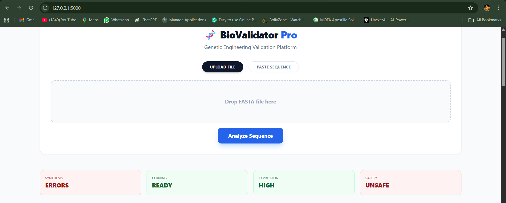
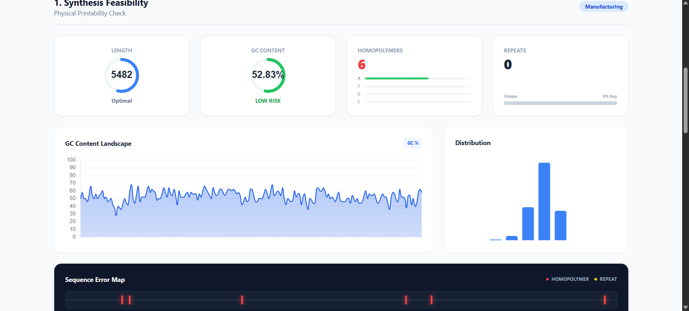
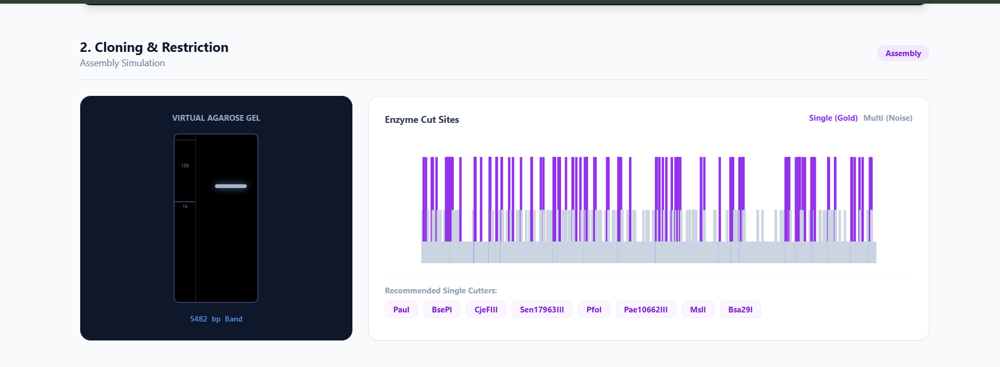
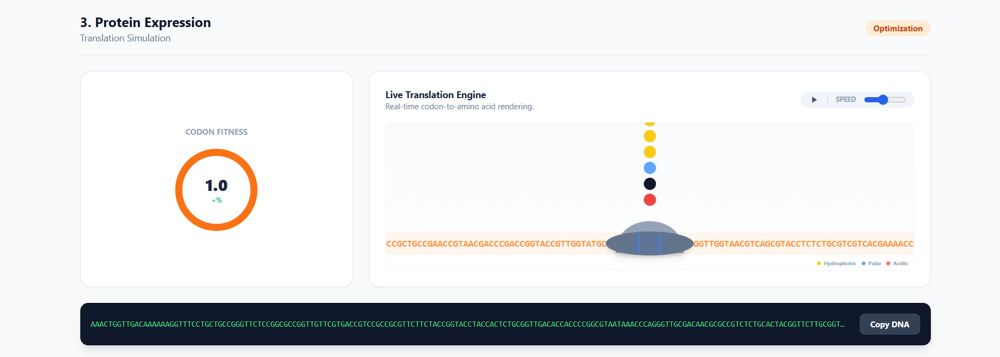
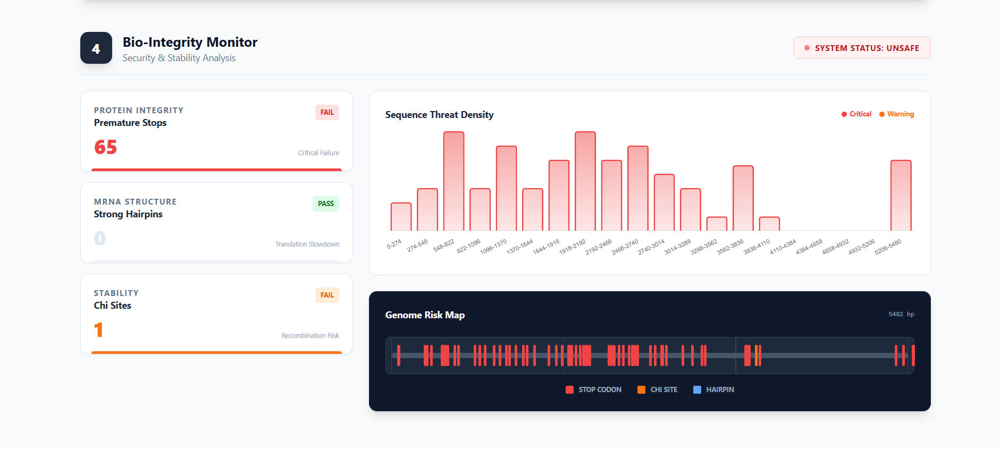

# 🧬 BioValidator Pro
**Next-Generation Genetic Engineering Validation & Optimization Suite**

[](https://www.python.org/downloads/)
[](https://flask.palletsprojects.com/)
[](https://opensource.org/licenses/MIT)

BioValidator Pro is a comprehensive bioinformatics dashboard designed to streamline the design-build-test cycle in synthetic biology. It provides scientists with instant feedback on sequence synthesis feasibility, cloning strategies, expression efficiency, and biosecurity risks.

> **🔬 Live Demo:** [biovalidator-pro.onrender.com](#) *(Coming Soon)*

---

## 🚀 Key Features

### 1. 📊 Synthesis Feasibility Monitor
- **GC Content Analysis**: Real-time landscape and distribution graphs
- **Error Detection**: Automated scanning for homopolymers and repetitive regions
- **Visual Error Mapping**: Instant pinpointing of manufacturing bottlenecks

### 2. 🧪 Cloning Cockpit
- **Virtual Agarose Gel**: Simulates DNA migration on 1% agarose gel with 1kb ladder
- **Restriction Skyline**: Professional "Lollipop Plot" visualizing enzyme cut sites
- **Single Cutter Identification**: Highlights optimal enzymes (Gold Standard)

### 3. 🧬 Ribosome Translation Simulator
- **Interactive Live Simulation**: Watch virtual ribosome translate mRNA in real-time
- **Chemical Accuracy**: Amino acids color-coded by properties (Hydrophobic, Polar, Acidic, Basic)
- **Codon Optimization**: Calculates CAI (Codon Adaptation Index) for expression efficiency

### 4. 🛡️ Bio-Integrity Console
- **Threat Detection**: Scans for premature stops, Chi sites, and strong hairpins
- **Risk Density Histogram**: Visualizes clustered error "Danger Zones"
- **Genome Risk Map**: Dark-mode genomic track for precision hazard location

---

## 🛠️ Technology Stack

| Component | Technology |
|-----------|------------|
| **Backend** | Python 3.9+, Flask 2.3 |
| **Bioinformatics** | Biopython 1.81 |
| **Frontend** | HTML5, Tailwind CSS, JavaScript |
| **Visualization** | Chart.js, SVG Animations, Canvas API |
| **Deployment** | Render.com *(coming soon)* |

---

## 💻 Installation & Setup

### Prerequisites
- Python 3.9 or higher
- pip (Python package manager)
- Git

### Step 1: Clone Repository
```bash
git clone https://github.com/BLACKZERO-1/BioValidator-Pro.git
cd BioValidator-Pro
```

### Step 2: Create Virtual Environment
```bash
# Windows
python -m venv venv
venv\Scripts\activate

# Linux/Mac
python3 -m venv venv
source venv/bin/activate
```

### Step 3: Install Dependencies
```bash
pip install -r requirements.txt
```

### Step 4: Run Application
```bash
cd backend
python app.py
```

### Step 5: Open in Browser
Navigate to: `http://127.0.0.1:5000`

---

## 📖 Usage Guide

### Quick Start
1. **Upload FASTA File** or **Paste Sequence** into the input box
2. Click **"Analyze Sequence"**
3. View comprehensive validation report across 4 modules
4. Download results as PDF *(feature coming soon)*

### Example Test Sequences

#### Test 1: GFP Gene (Good Sequence)
```
>GFP_optimized
ATGAGTAAAGGAGAAGAACTTTTCACTGGAGTTGTCCCAATTCTTGTTGAATTAGATGGTGATGTTAATGGGCACAAATTTTCTGTCAGTGGAGAGGGTGAAGGTGATGCAACATACGGAAAACTTACCCTTAAATTTATTTGCACTACTGGAAAACTACCTGTTCCATGGCCAACACTTGTCACTACTTTCTCTTATGGTGTTCAATGCTTTTCAAGATACCCAGATCATATGAAACGGCATGACTTTTTCAAGAGTGCCATGCCCGAAGGTTATGTACAGGAAAGAACTATATTTTTCAAAGATGACGGGAACTACAAGACACGTGCTGAAGTCAAGTTTGAAGGTGATACCCTTGTTAATAGAATCGAGTTAAAAGGTATTGATTTTAAAGAAGATGGAAACATTCTTGGACACAAATTGGAATACAACTATAACTCACACAATGTATACATCATGGCAGACAAACAAAAGAATGGAATCAAAGTTAACTTCAAAATTAGACACAACATTGAAGATGGAAGCGTTCAACTAGCAGACCATTATCAACAAAATACTCCAATTGGCGATGGCCCTGTCCTTTTACCAGACAACCATTACCTGTCCACACAATCTGCCCTTTCGAAAGATCCCAACGAAAAGAGAGACCACATGGTCCTTCTTGAGTTTGTAACAGCTGCTGGGATTACACATGGCATGGATGAACTATACAAATAA
```

#### Test 2: Problematic Sequence (Multiple Issues)
```
>Problem_seq
ATGAAAAAAAAACCCCCCCCCGGGGGGGGGTTTTTTTTTTCGATCGATCGATCGATCGATCGATCGCTGGTGGGCTGGTGGTAG
```
*(Contains: Homopolymers, Repeats, Chi sites)*

---

## 📸 Screenshots

## 📸 Gallery

### Main Dashboard


### Analysis Modules
| Synthesis Feasibility | Cloning & Restriction |
| :---: | :---: |
|  |  |

| Protein Expression | Bio-Integrity Console |
| :---: | :---: |
|  |  |

## 🐛 Troubleshooting

### Common Issues

**Issue**: `ModuleNotFoundError: No module named 'Bio'`  
**Solution**: Install Biopython: `pip install biopython`

**Issue**: `Port 5000 already in use`  
**Solution**: Change port in `app.py`: `app.run(port=5001)`

**Issue**: Visualization not rendering  
**Solution**: Clear browser cache or try different browser (Chrome recommended)

**Issue**: Large sequences (>50kb) slow  
**Solution**: This is normal. Optimization planned for v2.0

---

## 🗺️ Roadmap

- [x] Core 4 modules functional
- [x] Real-time visualizations
- [ ] Deploy to production
- [ ] Add PDF export
- [ ] Batch processing (multiple sequences)
- [ ] REST API for integration
- [ ] User accounts and history
- [ ] Mobile-responsive design
- [ ] Docker containerization

---

## 🤝 Contributing

Contributions are welcome! Please follow these steps:

1. Fork the repository
2. Create your feature branch (`git checkout -b feature/AmazingFeature`)
3. Commit your changes (`git commit -m 'Add some AmazingFeature'`)
4. Push to the branch (`git push origin feature/AmazingFeature`)
5. Open a Pull Request

---

## 📧 Contact

**Author**: [Badar Islam]  
**Email**: [badarislam4805@gmail.com]  
**LinkedIn**: www.linkedin.com/in/badar-islam-470426271 
**GitHub**: [@BLACKZERO-1](https://github.com/BLACKZERO-1)

---

## 📄 License

This project is licensed under the MIT License - see the [LICENSE](LICENSE) file for details.

---

## 🙏 Acknowledgments

- Biopython community for excellent bioinformatics tools
- Chart.js for visualization library
- Tailwind CSS for UI framework
- All beta testers and contributors


